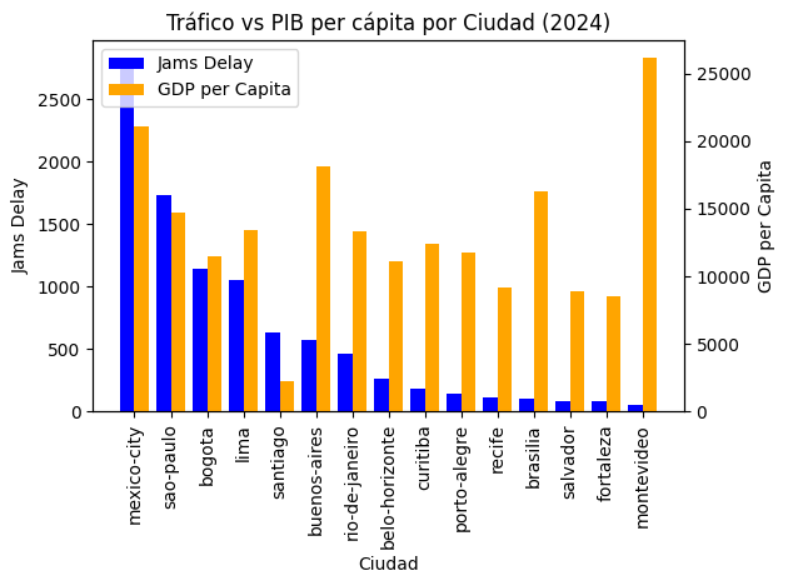
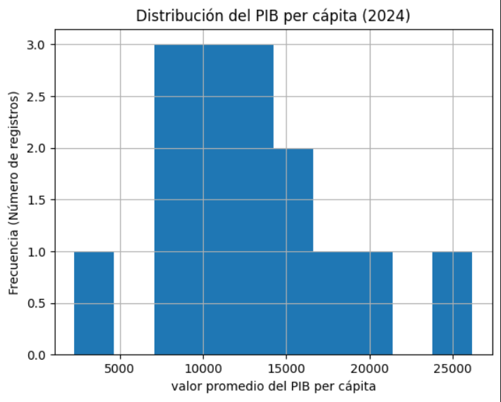

# Urban Mobility & Economic Productivity Analysis | LATAM (Python)

## 📌 Project Overview

This project analyzes the relationship between urban mobility (traffic congestion, delays) and economic productivity (GDP per capita, unemployment) across Latin American cities in 2024.

The objective is to identify cities where improving transportation infrastructure could drive economic growth and improve quality of life.

---

## 🎯 Business Questions

- Which cities show **high congestion and low economic productivity**?
- Which cities have **efficient mobility and strong economies**?
- What variables appear to have the strongest relationship with urban development?

---

## 🗂️ Dataset

This project integrates two real-world datasets:

- **TomTom Traffic Index** → Urban mobility metrics
- **OECD Cities** → Economic indicators (GDP, unemployment, population)

The final dataset was aggregated at **city–year level (2024)**.

---

## ⚙️ Methodology

- Data cleaning and standardization (column names, types, formats)
- Filtering for LATAM cities and year 2024
- Aggregation of traffic data by city
- Merging datasets using INNER JOIN
- Exploratory Data Analysis (EDA)
- Visualization of relationships between mobility and economic variables

---

## 📊 Key Visualizations

### Traffic vs GDP per Capita

### Traffic Distribution

---

## 📈 Executive Summary

### Context & Objective

This analysis evaluates the relationship between urban mobility (*jams_delay*) and economic productivity (*city_gdp_capita*) across Latin American cities in 2024. The goal was to determine whether higher congestion is associated with lower economic productivity.

### Data Coverage

The analysis includes multiple cities across Latin America, aggregated at the city-year level (2024), ensuring consistent comparison across mobility and economic indicators.

### Methodology

Data was cleaned, standardized, and validated. An INNER JOIN was used to combine datasets, ensuring only cities with complete data were included. Visualizations such as boxplots, histograms, and comparative charts were used to identify patterns.

### Key Findings

- No strong linear relationship was observed between congestion and GDP per capita  
- Mexico City shows high congestion with mid-level GDP  
- Montevideo shows high GDP with low congestion  
- Bogotá stands out with relatively high congestion and moderate-to-low GDP  

### Recommendations

Bogotá emerges as a priority candidate for infrastructure investment due to its combination of congestion and economic potential.

Further analysis is recommended including:
- Population density
- Urban growth
- Public transportation quality
- Statistical correlation analysis

---

## 🛠️ Tools Used

- Python (pandas, numpy, matplotlib, seaborn)
- Jupyter Notebook

---

## 📁 Files Included

- `Movilidad_Urbana_LATAM_Analisis_Final.ipynb` → Full analysis
- `ladb_mobility_economy_2024_clean.csv` → Clean dataset
